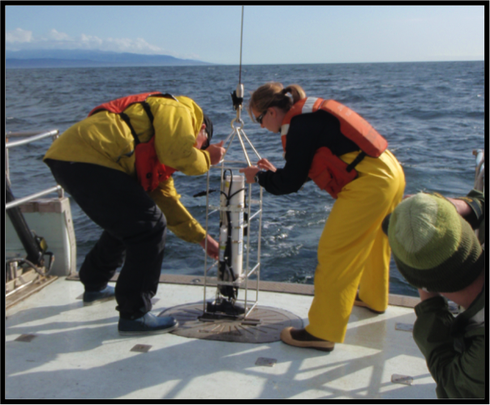
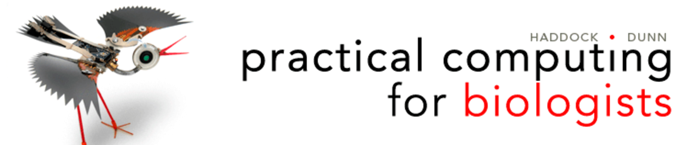
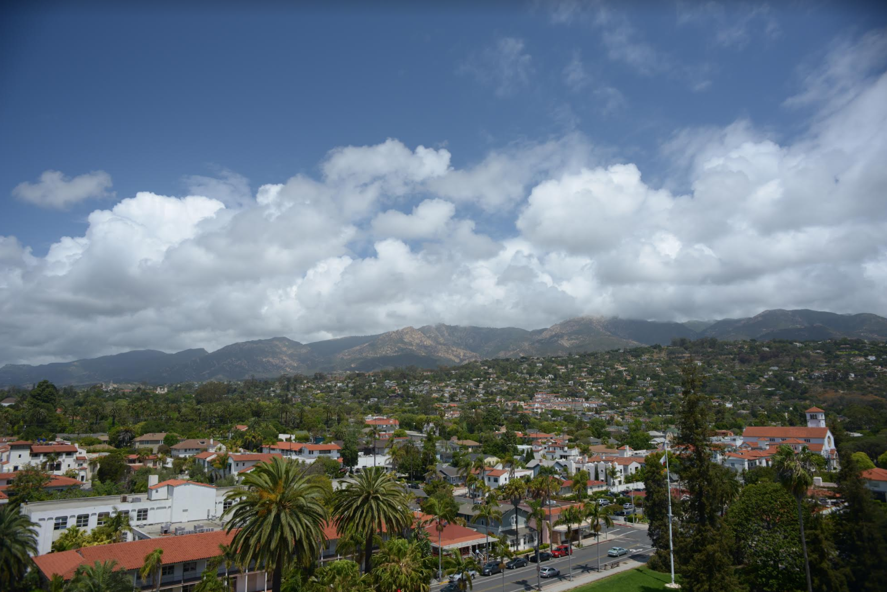
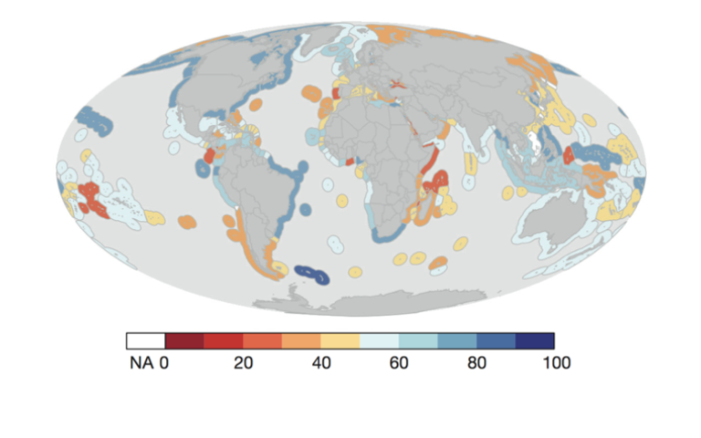
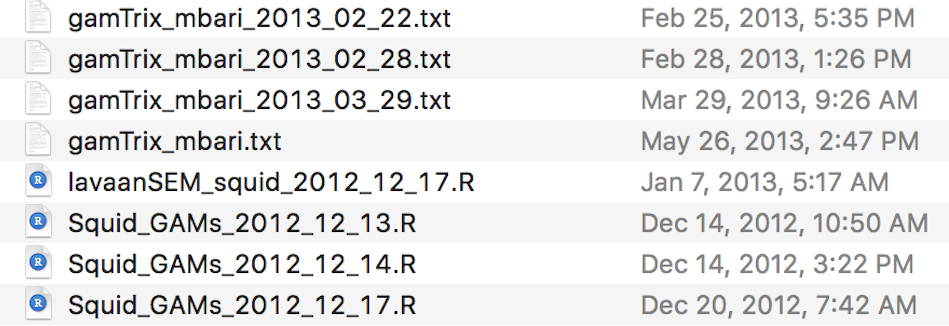
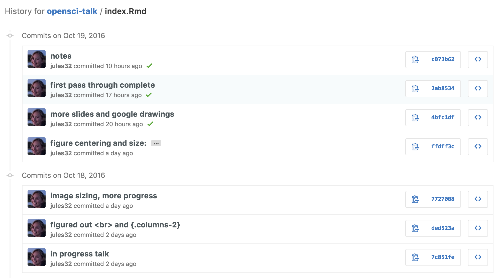
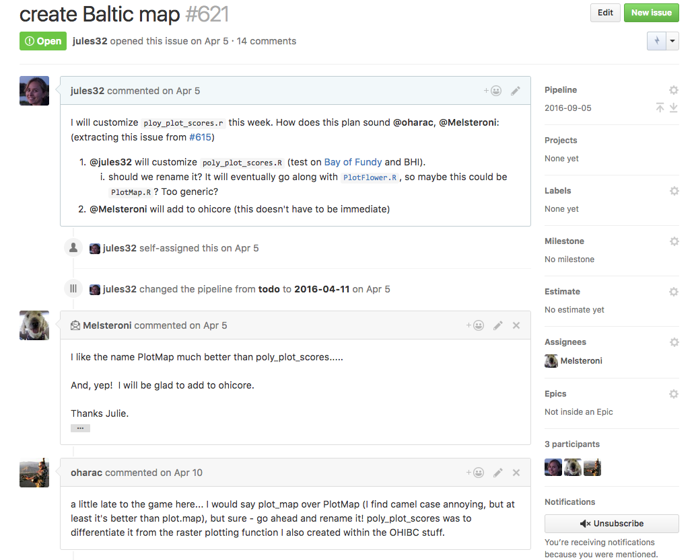
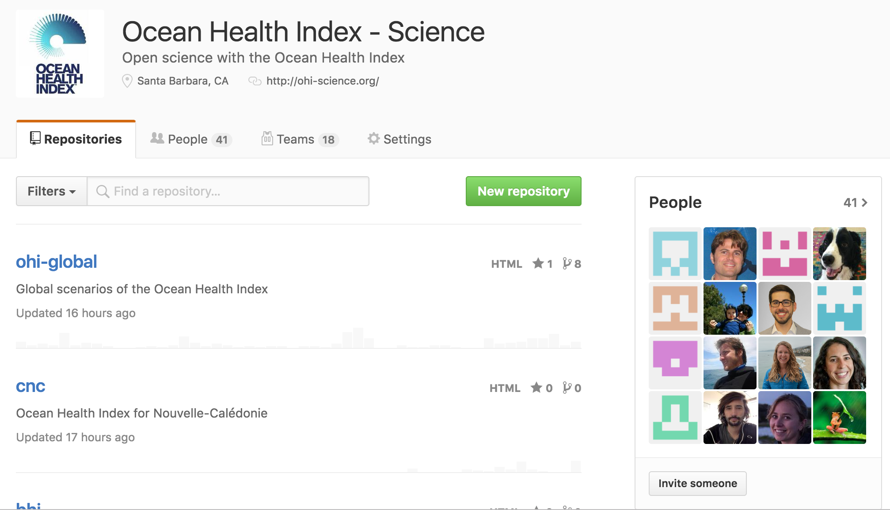
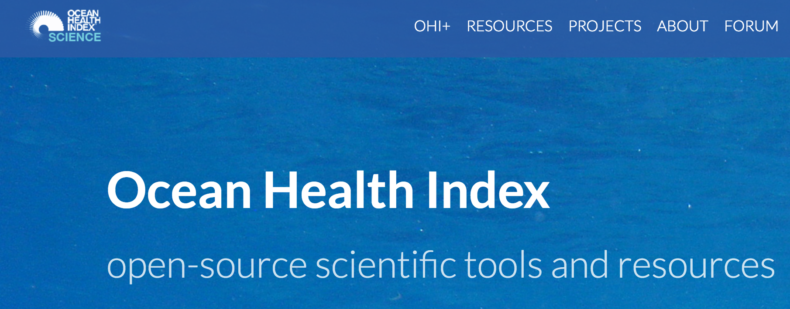

```{r setup, include=FALSE}
knitr::opts_chunk$set(fig.width=2, fig.path='figures/',
                      echo=FALSE, warning=FALSE, message=FALSE)
```
<!---
(while on title slide)
- Really great to be back at HMS, have been looking forward to this talk
- Since I was invited by the grad students and this is where I was a grad student, in putting together this talk I have been thinking about how to make it most useful for grad students particularly as well as the greater HMS community. 
- So, not only 'what I wish I'd known' but how to actually do it.  
- In 45 minutes. 

- Since leaving HMS I've begun to identify myself not only as a marine scientist and amateur programmer, but as a data scientist and advocate of open science. 
- I never thought that I would become a data scientist/programmer. I was pretty intimidated by programming.  

- But I've found it to be empowering and complementary to my interests as a marine scientist. I'm hoping to instill this feeling of excitement and empowerment that I have to everyone
--->


## Outline

- **Definitions and tools**

## Outline

- **Definitions and tools**

- **My programming origin story**
<!---Wikipedia: In comic book terminology, an origin story is an account or back-story revealing how a character or team gained their superpowers and/or the circumstances under which they became superheroes or supervillains.
--->

## Outline

- **Definitions and tools**

- **My programming origin story**

- **Reproducibility, collaboration and communication with open science tools**
<br>
    - *Lowndes et al., in prep*
    - reproducibility is fundamental, but rarely tested
    - tools have changed how we do science <!--- as much as email did --->

## Outline

- **Definitions and tools**

- **My programming origin story**

- **Reproducibility, collaboration and communication with open science tools**
<br>
    - *Lowndes et al., in prep*
    - reproducibility is fundamental, but rarely tested
    - tools have changed how we do science <!--- as much as email did --->

- **Resources and recommendations**
    - exposure to tools and confidence to use them
<!---We find scientists elsewhere are eager to implement open science concepts, but generally have not been exposed to the necessary tools available to suit their needs or lack the knowledge and confidence to begin using them. We've been teaching other scientists--->

## Data science and open science {.smaller}
<!---1/3--->
**Data science**:  

"an exciting discipline that allows you to turn raw data into understanding, insight, and knowledge"
([*Grolemund & Wickham 2016*](http://r4ds.had.co.nz/))


## Data science and open science {.smaller}
<!---2/3--->
**Data science**:  

"an exciting discipline that allows you to turn raw data into understanding, insight, and knowledge"
([*Grolemund & Wickham 2016*](http://r4ds.had.co.nz/))

<figure>
<p align = 'center'>

</figure>

## Data science and open science {.smaller}
<!---3/3--->
**Data science**:  

"an exciting discipline that allows you to turn raw data into understanding, insight, and knowledge"
([*Grolemund & Wickham 2016*](http://r4ds.had.co.nz/))

<figure>
<p align = 'center'>

</figure>

**Open science**:  

"the concept of transparency at all stages of the research process, coupled with free and open access to data, code, and papers" ([*Hampton et al. 2014*](http://onlinelibrary.wiley.com/doi/10.1890/ES14-00402.1/full))

## Open science tools {.smaller}

<figure>
<p align = 'center'>

</figure>

links: [**R**](https://cran.r-project.org/), [**RStudio**](https://www.rstudio.com/), [**git**](https://git-scm.com/), [**GitHub**](https://www.github.com/)

<!---
These are the tools we use and what I mean when I talk about data science and open science tools. 
There are other options out there but these are used by many communities, including Silicon Valley and industry. These things weren't developed for scientists but for coders; we can borrow from what they've learned.
--->

## Open science workflow {.smaller}

<figure>
<p align = 'center'>

</figure>

## Open science workflow {.smaller}

<figure>
<p align = 'center'>

</figure>

this talk: [jules32.github.io/opensci-talk](http://jules32.github.io/opensci-talk)
 
 - written in RStudio's [RMarkdown](http://rmarkdown.rstudio.com/) ([RStudio 1-min video](https://vimeo.com/178485416))
 - versioned with Git
 - displayed/shared with GitHub

<!---
I'm going to talk about 2 main open science tools we use and how I couldn't do my job without them. A whole ecosystem of tools and resources to learn them have been developing since I was here at Hopkins and I wish I had had them. So this isn't going to be a normal science talk but more of the tools we use to make our science more reproducible. 

The punchline is that we as environmental scientists, ecologists can be working more efficiently, collaboratively, and reproducibliy than we are. 
There are existing tools and existing resources to learn them that will greatly improve your science and make you more equipped for future projects and jobs. These tools have changed our approach to science as much as email did. 

We made these changes incrementally over 3.5 years and are still improving; can't be an all-at once thing!  We didn't do this overnight; it was an evolution, not a revolution.
--->

## My programming origin story {.smaller}

<figure>
<p align = 'center'>

</figure>

<div class="centered">
*Photo credit: Greg Auger*
</div>


## Some thesis questions 

> - what are Humboldt squid habitat preferences?
- what season are they most abundant?
- how fast and far can they migrate?
- how do they interact with other species? 
- how do I work with data that's too big for Excel?
- how do I subset years or other attributes?
- how do I visualize this?
- how on earth do I even think about this?


## Conflated questions {.smaller .columns-2}

**Science:**

- what are their habitat preferences?
- what season are they most abundant?
- how fast and far can they migrate?
- how do they interact with other species? 
<br>


**Data science:** 

- how do I work with data too big for Excel?
- how do I subset years or other attributes?
- how do I visualize this?
- how on earth do I even think about this?


<!--- 
Conflated science questions, easy to get discouraged
--->

## I learned to program like many do

> - in a panic
- for a single purpose (get this thesis done!)  <!---but it was scripted! Was able to understand now--->
- in isolation*
<br>
<br>
<br>

## I learned to program like many do

- in a panic
- for a single purpose (get this thesis done!)  
- in isolation*
<br>
<br>
<br>
  
\* except for wonderful programming mentors: 

Steve Haddock, Dave Foley, Ashley Booth



<!---with these mentors I was able to learn Matlab, answer my questions, and graduate! --->


## NCEAS, UC Santa Barbara

<figure>
<p align = 'center'>

</figure>


<!---Let's continue on to NCEAS where I've grown as a data scientist.  --->

## Ocean Health Index {.smaller}

<!---Without getting into too many details of the project --->

method to categorize benefits that oceans provide to people  

scores are modeled using existing data; data intensive  

<figure>
<p align = 'center'>

</figure>

## Ocean Health Index {.smaller}

<!---Without getting into too many details of the project --->

method to categorize benefits that oceans provide to people  

scores are modeled using existing data; data intensive  

<figure>
<p align = 'center'>

</figure>

method can be tailored to different geographies  

can help inform policy decisions, especially when repeated


## OHI Global Assessments

<!---
- Assess coastlines of nations and territories
- Lots of data, ranging from categorical tabular data to high resolution rasters - from nearly one hundred freely available, existing sources

- We were planning to repeat the global assessment annually and also support other groups that wanted to lead their own assessments. 

- highly collaborative
--->

**2012: OHI method and first global assessment** ([*Halpern et al. 2012*](http://www.nature.com/nature/journal/v488/n7413/abs/nature11397.html))

<figure>
<p align = 'center'>

</figure>


## OHI Global Assessments
<!---
This is when I was hired --->


**2013: second annual global assessment**

- repeat methods
- update data 
- compare between years

## OHI Global Assessments

**2013: second annual global assessment**

- repeat methods
- update data 
- compare between years  
<br>
<br>  

We expected to easily reproduce our previous work. We had planned ahead: 

<!--- standard approaches to marine science/reproduciblity --->

- coded models
- 130 pages of published supplemental material
- internal documents and notes

## We thought we were doing reproducible science

We struggled to reproduce our work using standard approaches
<!---The effort to develop the first global OHI assessment was highly collaborative, which created additional challenges beyond data preparation. --->

## We thought we were doing reproducible science

We struggled to reproduce our work using standard approaches

...mainly due to our approaches to data preparation (data science)

<figure>
<p align = 'center'>

</figure>


## We thought we were doing reproducible science

We struggled to reproduce our work using standard approaches

...mainly due to our approaches to data preparation (data science)

<figure>
<p align = 'center'>

</figure>

Additional challenge of managing multiple years
<!--- we needed a nimble approach to sharing data, methods, and results within and outside our team --->


## Overcoming three main challenges | Completed second assessment by addressing:

1) **reproducibility** <!--- transparency and repeatability, esp. data prep --->
2) **collaboration** <!--- teamwork and internal collaboration --->
3) **communication** <!---with scientific and public communities --->

## Overcoming three main challenges | Completed second assessment by addressing:

1) **reproducibility**
2) **collaboration**
3) **communication**

<br>
<br>
<br>

*Lowndes et al. Improving reproducibility, collaboration, and communication in environmental
science using open science tools, in prep*


## Addressing challenges using open science tools

<!---will talk a bit about the cultural changes in reproduciblity and collaboration--->

<figure>
<p align = 'center'>

</figure>


## Addressing challenges using open science tools

<!---will talk a bit about the cultural changes in reproduciblity and collaboration--->

<figure>
<p align = 'center'>

</figure>


<!---I'm just going to give an example or two of each; will describe before and after; happy to discuss more afters and will let you read the paper when it comes out--->

## Reproducibility - data preparation 

*"Data scientists, according to interviews and expert estimates, spend from 50 percent to 80 percent of their time mired in the mundane labor of collecting and preparing data, before it can be explored for useful information." - [NYTimes (2014)](http://www.nytimes.com/2014/08/18/technology/for-big-data-scientists-hurdle-to-insights-is-janitor-work.html)*

- transforming, rescaling, gap-filling, formatting, renaming, etc.
- seldom mentioned but underpins the scientific process

<figure>
<p align = 'center'>

</figure>

## Reproducibility - data preparation 
<!---ranging from categorical tabular data to high resolution rasters - from nearly one hundred freely available, existing sources--->

**Before**

- manually (without coding)
- largely Microsoft Excel
- internal documents and emails


**After**

- full process coded 
    - R with documentation 
    - RMarkdown

## Reproducibility - data preparation {.smaller}

Philosophy of data wrangling
<br>
[Grolemund & Wickham 2016: *R for Data Science*](http://r4ds.had.co.nz/tidy-data.html#spreading-and-gathering)
<!---    
- increases readability
- reduces potential for error
- these things took me forever to do and now there's one command
- talk about philosophy: some ways are better than others. Resources available for packages, tidyverse
--->

<figure>
<p align = 'center'>

</figure>


## Reproducibility - version control {.smaller}

*"For scientist coders, [Git] works like a laboratory notebook for scientific computing...it keeps a lasting record of events." - [Nature 2016](http://www.nature.com/news/democratic-databases-science-on-github-1.20719)*


## Reproducibility - version control {.smaller}

*"For scientist coders, [Git] works like a laboratory notebook for scientific computing...it keeps a lasting record of events." - [Nature 2016](http://www.nature.com/news/democratic-databases-science-on-github-1.20719)*

<figure>
<p align = 'center'>

</figure>

<!---    
this is something I did not appreciate the first few times I was introduced to it. I thought, I work alone, I have a fine system of versioning
I'm not even going to ask if this looks familiar because I already know
--->


## Reproducibility - version control

**Before**

- filenames suffixed with dates, initials 
    - e.g. `final.csv` and `final_JL-2016-08-05.csv`
- email descriptions of what changed between files

**After**

- version control with `git`
- short messages accompany committed changes

## Reproducibility - version control {.smaller}

<figure>
<p align = 'center'>

</figure>

Demo: [link](https://github.com/jules32/opensci-talk/commits/gh-pages/index.Rmd)


## Collaboration - communication + file sharing

<figure>
<p align = 'center'>

</figure>

## Collaboration - communication + file sharing

**Before**

- email chains (often forwarded) 

**After**

- GitHub issues

<!---
record of history
tag specific people
close tasks
--->

<!---Redesigning our team's workflow required a substantial time investment to learn the tools, and a paradigm shift in our approach to collaboration. Previous to this investment, most team members with any coding experience had learned just enough to accomplish specific tasks (not necessarily in R), and had developed unique conventions. Given the complexity of the project, we needed to learn to code collaboratively and incorporate best practices into our coding25 so that methods for data preparation and modeling could be co-developed and vetted by multiple team members. Further, using a version control system allowed individuals to feel less inhibited about their coding contributions, since files could always be reverted back to previous versions if there were problems.

email chains or memory. This lack of transparency and repeatability was even more problematic for new team members--->

## Collaboration - communication + file sharing {.smaller}

<figure>
<p align = 'center'>

</figure>

Demo [link](https://github.com/OHI-Science/issues/issues/621) (private)

## Communication - sharing data, code, methods


## Communication - sharing data, code, methods

**Before**

- published manuscripts
- data on FTP server

**After**

- published manuscripts
- work openly on GitHub [github.com/OHI-Science](https://github.com/ohi-science)
- website with methods, instruction, data [OHI-Science.org](http:ohi-science.org)

## Communication - sharing data, code, methods {.smaller .columns-2}


<br>
Demo: [github.com/OHI-Science](https://github.com/ohi-science)

<!---NO JARGON

--->


<br>
Demo: [OHI-Science.org](http:ohi-science.org)

## Ocean Health Index Today

These tools and this workflow make our science possible. 

## Ocean Health Index Today

These tools and this workflow make our science possible.  

- December 8 2016: releasing 5th global assessment
- Support and training for government or academic 'OHI+' assessments

<!---and this paper will be coming out--->

All on [ohi-science.org](http://ohi-science.org)

<figure>
<p align = 'center'>

</figure>

## Better science in less time {.smaller}

- incremental adoption
- always improving, learning
- teaching and training, support

<figure>
<p align = 'center'>

</figure>


## My recommendations | Get to your science questions sooner {.smaller .columns-2}

<figure>

</figure>

<br>
<br>

**1. Learn to code**  
&nbsp;&nbsp;&nbsp; - in [**R**](https://cran.r-project.org/)  
&nbsp;&nbsp;&nbsp; - with [**RStudio**](https://www.rstudio.com/)  

<!---IDE makes it less intimdating, and so many features for new and seasoned programmers alike--->

**2. Use version control**  
&nbsp;&nbsp;&nbsp; - [**git**](https://git-scm.com/)  
&nbsp;&nbsp;&nbsp; - with [**GitHub**](https://www.github.com/)  
&nbsp;&nbsp;&nbsp; - through [**RStudio**](https://www.rstudio.com/)  

<!---What this might mean today is having a lab webpage, and maybe personal webpage, twitter account and a github account --->

**Introduce these concepts incrementally**  

## Great resources {.smaller}

**Books, trainings, and webinars**: 

- [ohi-science.org/news: Resources for R and Data Science](http://ohi-science.org/news/Resources-for-R-and-Data-Science)

<br>
<br>
**Recent academic publications**: 

- "How open science helps researchers succeed" ([*McKiernan et al. 2016*](https://elifesciences.org/content/5/e16800v2))
- "Best Practices for Scientific Computing" ([*Wilson et al. 2014*](http://journals.plos.org/plosbiology/article?id=10.1371/journal.pbio.1001745))
- "Good Enough Practices for Scientific Computing" ([*Wilson et al. 2016*](https://swcarpentry.github.io/good-enough-practices-in-scientific-computing/))

<br>
<br>

## Learn to program in an intentional way

> - ~~in a panic~~ feeling empowered
- ~~for a single purpose~~ thinking ahead
- ~~in isolation~~ with a community


## Community 

Join existing and create new communities - locally and online

- Twitter: [#rstats](https://twitter.com/search?q=%23rstats&src=tyah) 
- [Mozilla Study Groups](https://science.mozilla.org/blog/introducing-mozilla-science-study-groups)

<figure>
<p align = 'center'>

</figure>

<!---It is hard, but it's powerful and isn't that bad. People have blazed these trails and we can build from there ---> 

<!---These help "dispel the misconception that these skills are intuitive, obvious, or in any way inherent"  
([*Mills 2015*](https://science.mozilla.org/blog/introducing-mozilla-science-study-groups))--->

<!---study groups, community
OHI community
NCEAS community
UCSB community
online community. We put ourselves out there to join the programming community and they have welcomed us

Photo of us with Hadley. We're marine scientists talking with Silicon Valley programmers, you're at Stanford, 

I went from my crazy file structure to being into all of this in a year and a half. It istn't as scary and hard as 
--->


## Thank you  {.smaller .columns-2}

<!--- now that you've got the exposure, this will give you confidence --->

<figure>
<p align = 'center'>

</figure>

<br>


**THANK YOU** 
<br>
to my team, colleagues, #rstats community 
<br>
<br>
email: lowndes @nceas.ucsb.edu  
twitter: @juliesquid  
talk url: [https://jules32.github.io/opensci-talk](https://jules32.github.io/opensci-talk)  
<br>

**15-minute version of this talk at WSN**:  
Friday, Nov 11, Session 7, 3pm  
<br>
**NCEAS is hiring**: [nceas.ucsb.edu/positionsopen](https://www.nceas.ucsb.edu/positionsopen)

<!---
- Deputy Director
- Scientific Programmer
- Scientific web developer/designer
- Training and Outreach Coordinator
- Projects Data Coordinator
--->


##


