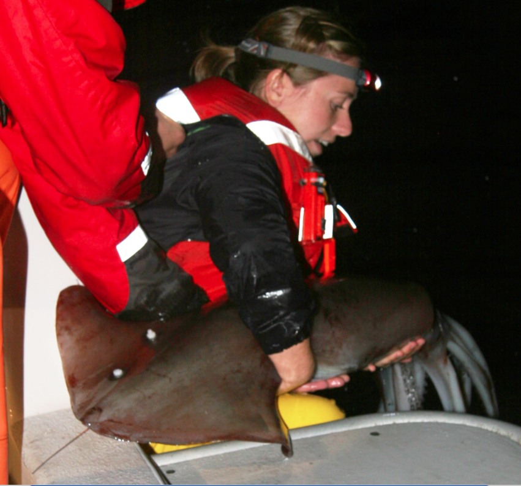
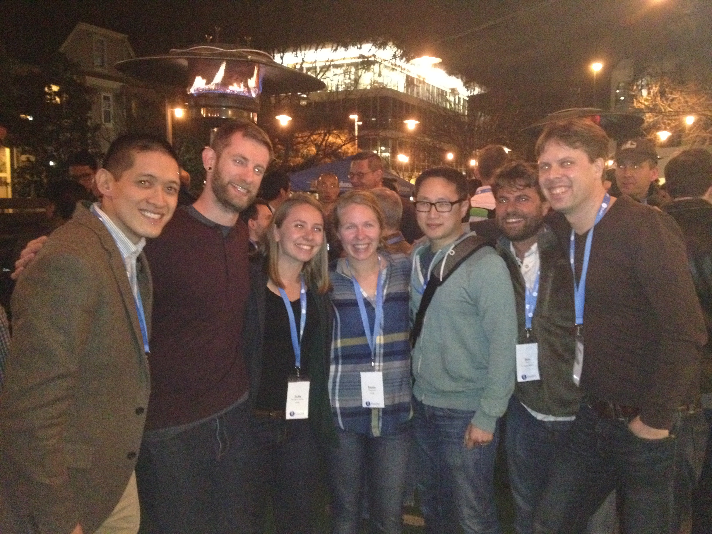

```{r setup, include=FALSE}
knitr::opts_chunk$set(fig.width=2, fig.path='figures/',
                      echo=FALSE, warning=FALSE, message=FALSE)
```

## Trying to do reproducible science

<br>
<br>

<p align = 'center'><font size="16">`data_final_v2.xls`  </font></p>
<br>
<br>

<p align = 'center'><font size="16">`Re: FWD: data question`  </font></p>
<br>
<br>
<br>
<br>

<span style="color:red">
***Sorry guys, this probably isn't reproducible science***
</span>


## Actually doing reproducible science 

<br>

We struggled to reproduce and repeat our own work. 

Data science principles and tools have changed how we do science:  

- reproducibility
- collaboration
- communication  


<br>
<br>
<br>
Upcoming paper: how we now do reproducible science by leveraging from data science - philosophy and tools
<p align = 'right'>*Lowndes et al., in prep*: </p>

## Data science
<!---1/2--->

A discipline "to turn raw data into understanding, insight, and knowledge"
<p align = 'right'>[*Grolemund & Wickham 2016*](http://r4ds.had.co.nz/)</p>

## Data science
<!---2/2--->

A discipline "to turn raw data into understanding, insight, and knowledge"
<p align = 'right'>[*Grolemund & Wickham 2016*](http://r4ds.had.co.nz/)</p>

<figure>
<p align = 'center'>

</figure>

## Science and data science {.columns-2}

**Science:**

- when is X most abundant?
- what is Y's habitat preferences?
<br>
<br>
  
*This is scientific discovery; these questions don't yet have answers.*

<br>
<br>
<br>
<br>
<br>
<br>
<br>
<br>


## Science and data science {.columns-2}

**Science:**

- when is X most abundant?
- what is Y's habitat preferences?
<br>
<br>
  
*This is scientific discovery; these questions don't yet have answers.*


**Data science:** 

- how do I import my data?
- how do I subset the years I want?
<br>
<br>
  
<br>
*This is data science; there are existing solutions and tools for this*

## Ocean Health Index | a method to score benefits that oceans provide to people  

<figure>
<p align = 'center'>

</figure>


<p align = 'right'>[*Halpern et al. 2012*](http://www.nature.com/nature/journal/v488/n7413/full/nature11397.html)</p>

## Ocean Health Index | a method to score benefits that oceans provide to people

<figure>
<p align = 'center'>

</figure>


- we struggled to reproduce our own work
- we had focused only on scientific methods, not data prep ( = data science)

## Ocean Health Index | we now work reproducibly, and support others building from our work  

<figure>
<p align = 'center'>

</figure>

<p align = 'right'>[*Halpern et al. 2012*](http://www.nature.com/nature/journal/v488/n7413/full/nature11397.html); [*Halpern et al. 2015*](http://journals.plos.org/plosone/article?id=10.1371/journal.pone.0117863); [*Lowndes et al. 2015*](http://doi.org/10.7717/peerj.1503)</p>

## Data science tools | we use these free, open-source tools with growing, inclusive communities

<figure>
<p align = 'center'>

</figure>


## Doing reproducible science | coding + version control are the keystone

<figure>
<p align = 'center'>

</figure>


## Doing reproducible science | but must also collaborate and communicate effectively

<figure>
<p align = 'center'>

</figure>

## Doing reproducible science

<figure>
<p align = 'center'>

</figure>

this talk: [**jules32.github.io/opensci-talk/short**](http://jules32.github.io/opensci-talk/short)  
 
*written in [RStudio's RMarkdown](http://rmarkdown.rstudio.com/), versioned with [Git](https://git-scm.com/), displayed/shared with [GitHub](https://www.github.com/)*

## Doing reproducible science | You too can do better science in less time {.columns-2}

**1. Learn to code**  
&nbsp;&nbsp;&nbsp; - in [**R**](https://cran.r-project.org/)  
&nbsp;&nbsp;&nbsp; - with [**RStudio**](https://www.rstudio.com/)  

<!---IDE makes it less intimdating, and so many features for new and seasoned programmers alike--->

**2. Use version control**  
&nbsp;&nbsp;&nbsp; - [**git**](https://git-scm.com/)  
&nbsp;&nbsp;&nbsp; - with [**GitHub**](https://www.github.com/)  
&nbsp;&nbsp;&nbsp; - through [**RStudio**](https://www.rstudio.com/)  

<br>
<br>
<br>
<br>
<br>
<br>

## Doing reproducible science | You too can do better science in less time {.columns-2}

**1. Learn to code**  
&nbsp;&nbsp;&nbsp; - in [**R**](https://cran.r-project.org/)  
&nbsp;&nbsp;&nbsp; - with [**RStudio**](https://www.rstudio.com/)  

<!---IDE makes it less intimdating, and so many features for new and seasoned programmers alike--->

**2. Use version control**  
&nbsp;&nbsp;&nbsp; - [**git**](https://git-scm.com/)  
&nbsp;&nbsp;&nbsp; - with [**GitHub**](https://www.github.com/)  
&nbsp;&nbsp;&nbsp; - through [**RStudio**](https://www.rstudio.com/)  

**3. Learn in an intentional way**

- **feel empowered** (~~in a panic~~) 
- **think ahead** (~~for a single purpose~~)  
- **with a community** (~~in isolation~~)  


## Great resources 

**So many amazing + free online books, trainings, and webinars**: 

- [ohi-science.org/news: Resources for R and Data Science](http://ohi-science.org/news/Resources-for-R-and-Data-Science)

<br>
<br>
**Recent academic publications**: 

- "How open science helps researchers succeed" ([*McKiernan et al. 2016*](https://elifesciences.org/content/5/e16800v2))
- "Best Practices for Scientific Computing" ([*Wilson et al. 2014*](http://journals.plos.org/plosbiology/article?id=10.1371/journal.pbio.1001745))
- "Good Enough Practices for Scientific Computing" ([*Wilson et al. 2016*](https://swcarpentry.github.io/good-enough-practices-in-scientific-computing/))
- "Democratic databases: science on GitHub" ([*Perkel 2016*](http://www.nature.com/news/democratic-databases-science-on-github-1.20719)
- "Practical Computing for Biologists" ([*Haddock & Dunn*](http://practicalcomputing.org/))

<br>


## Thank you | HUGE thanks to the OHI team, colleagues, #rstats community 

<figure>
<p align = 'center'>

</figure>

[ohi-science.org](https://ohi-science.org)  -> our website, collaboratively made (by us!) with GitHub

email: lowndes @nceas.ucsb.edu  
twitter: @juliesquid, @OHIscience  
website: [jules32.github.io](https://jules32.github.io)  
talk url: [jules32.github.io/opensci-talk/short](https://jules32.github.io/opensci-talk/short); [45-min version](https://jules32.github.io/opensci-talk)  

**NCEAS is hiring**: [nceas.ucsb.edu/positionsopen](https://www.nceas.ucsb.edu/positionsopen)

<!---
- Deputy Director
- Scientific Programmer
- Scientific web developer/designer
- Training and Outreach Coordinator
- Projects Data Coordinator
--->


##


